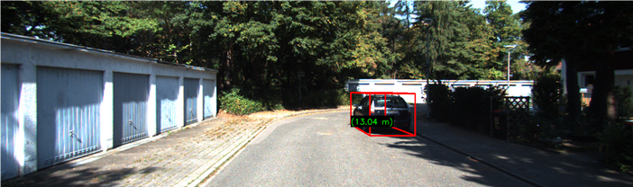
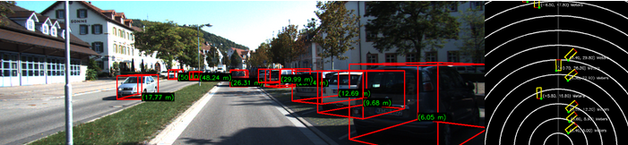

# MonoViz - Enhanced MonoRCNN for Visualization and Distance Estimation

MonoViz is an advanced extension of the MonoRCNN framework, aimed at enhancing visualization and incorporating accurate distance estimation into the object detection pipeline. This project builds upon MonoRCNN, published at ICCV 2021 and WACV 2023, with innovative modifications to improve its applicability in autonomous driving and advanced driver-assistance systems (ADAS). MonoViz introduces significant enhancements, including intuitive visual outputs, bird’s-eye view projections, and accurate distance estimation using both x-axis (lateral) and z-axis (longitudinal) coordinates. These features make it a versatile and cost-effective solution for monocular 3D object detection.

## Enhanced Features of MonoViz

- **Improved Visualization**: MonoViz overlays 3D bounding boxes and distance annotations directly on the original image, providing clear and intuitive spatial context for detected objects.
- **Distance Estimation**: Unlike MonoRCNN, MonoViz includes a dedicated distance estimation module that computes object distances using a combination of height-based and geometric modeling techniques. This extension allows for precise estimation in both lateral and longitudinal dimensions.
- **Bird’s-Eye View Projections**: The system generates a bird’s-eye view representation, plotting objects with orientation and spatial coordinates on a 2D plane to enhance situational awareness.
- **Expanded Output Metrics**: In addition to visual outputs, MonoViz provides detailed logs, accuracy metrics, and a consolidated `dist.txt` file for further analysis.

## Visualization

- **KITTI Dataset**
  

- **Bird’s-Eye View Projections**
  

These outputs are designed to provide an integrated and user-friendly visualization experience, bridging the gap between research prototypes and real-world applications.

## Experiment Results: KITTI Dataset

MonoViz was rigorously tested on the KITTI dataset, a benchmark in autonomous driving research. The results highlight the system’s performance across varying object types and tolerance thresholds:

- **Cars Only**:
  - 5% tolerance: 65.81% accuracy
  - 10% tolerance: 83.62% accuracy
  - 15% tolerance: 90.32% accuracy
  - 20% tolerance: 93.07% accuracy

- **Cars and Pedestrians**:
  - 5% tolerance: 65.59% accuracy
  - 10% tolerance: 82.93% accuracy
  - 15% tolerance: 89.63% accuracy
  - 20% tolerance: 92.66% accuracy

- **Cars, Pedestrians, and Cyclists**:
  - 5% tolerance: 50.70% accuracy
  - 10% tolerance: 76.99% accuracy
  - 15% tolerance: 88.20% accuracy
  - 20% tolerance: 93.24% accuracy

### Insights

- **Strengths**: MonoViz excels in generating actionable insights with its visual outputs, bird’s-eye view projections, and comprehensive distance data. Its use of monocular cameras provides a cost-effective alternative to LiDAR systems.
- **Challenges**: The model's performance at stricter tolerance thresholds (e.g., 5%) and in long-range detection (>35 meters) reflects inherent limitations of monocular systems. Further enhancements, such as integrating stereo vision or additional datasets, can improve accuracy.

## MonoViz vs. MonoRCNN

While MonoRCNN focuses primarily on 3D object detection using monocular images, MonoViz adds several critical features:
- **Distance Estimation**: Incorporates accurate distance predictions for both x- and z-axes.
- **Bird’s-Eye View**: Provides a 2D spatial representation for enhanced situational awareness.
- **Enhanced Usability**: Outputs are tailored for both developers and end-users, with detailed annotations and comprehensive metrics.

## Getting Started

### Installation
MonoViz builds upon MonoRCNN, and the requirements are similar:
- Python 3.6
- PyTorch 1.5.0
- Detectron2 0.1.3

### Dataset Preparation
MonoViz uses the KITTI dataset. Detailed instructions for preparing the dataset are available [here](projects/KITTI/README.md).

### Training
```bash
cd projects/MonoViz
./main.py --config-file config/MonoViz_KITTI.yaml --num-gpus 1
